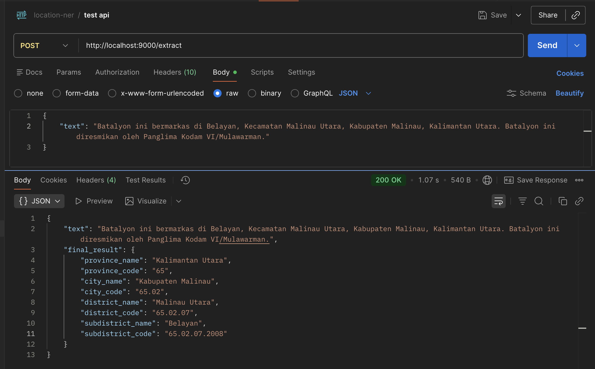
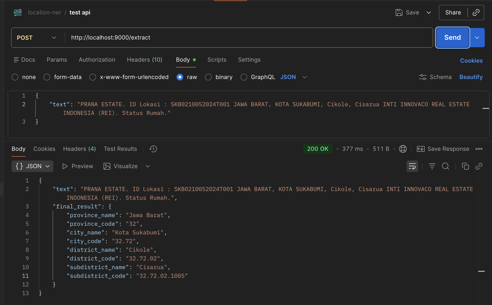
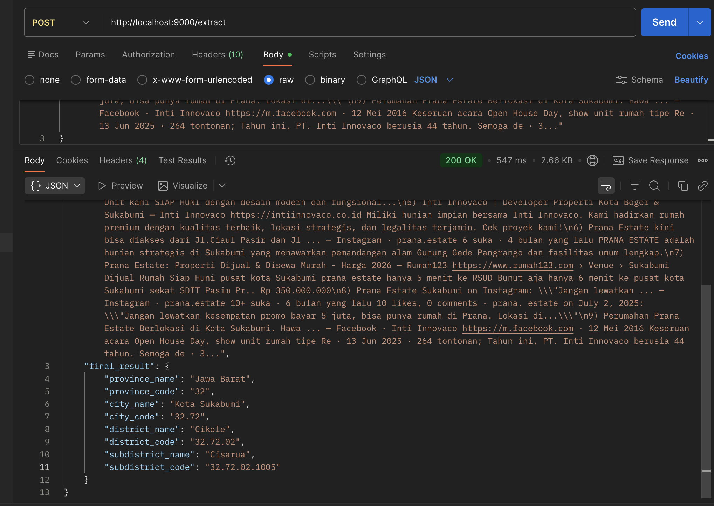

# Example API Server (FastAPI)

This is a minimal FastAPI server example for the `location-ner` library.

- Endpoint: `POST /extract`
- Request JSON: `{"text": "..."}`
- Response JSON: `{"text": "...", "final_result": {...}}`

By default, the server loads the gazetteer CSV **once at startup** and reuses it for all requests.

Optionally, if `LOCATION_NER_HF_MODEL` is set, it also loads the HuggingFace NER model once and enables NER-gated extraction.

## Setup

### 1) Create a virtual environment (recommended)
From `examples/api_server_fastapi/`:

```bash
# IMPORTANT: use Python 3.10+
python3 -m venv .venv
source .venv/bin/activate
python3 -m pip install -U pip
```

### 2) Install dependencies

From `examples/api_server_fastapi/`:

```bash
python3 -m pip install -r requirements.txt

# Quick sanity check
python3 -c "import location_ner; print('ok')"
```

This installs `id-location-ner` from PyPI plus FastAPI/Uvicorn.

To enable HF/NER-assisted mode, install the optional extra:

```bash
python3 -m pip install "id-location-ner[hf]"
```

### 3) Configure environment

Copy the example env file and edit it:

```bash
cp .env.example .env
```

Then set at least:
- `LOCATION_NER_CSV` (absolute path to your Kemendagri-style CSV)

Optional:
- `LOCATION_NER_API_HOST` (default: `0.0.0.0`)
- `LOCATION_NER_API_PORT` (default: `8000`)
- `LOCATION_NER_FUZZY_THRESHOLD` (default: `90`)

Optional (HF/NER-assisted mode):
- `LOCATION_NER_HF_MODEL` (enables HF mode when set)
- `LOCATION_NER_NER_FILTER_MIN_SCORE` (default: `0.5`, only used when HF mode is enabled)

Notes:
- `.env` is ignored by git.
- If you want to load a different env file, set `LOCATION_NER_ENV_FILE=/path/to/file.env`.

## Run

HF mode note: if you set `LOCATION_NER_HF_MODEL`, also install `id-location-ner[hf]`.

### Option A (recommended): run via env-configured wrapper
This reads `LOCATION_NER_API_HOST` and `LOCATION_NER_API_PORT` from your `.env`.

```bash
python run.py
```

### Option B: run uvicorn directly
From this folder:
```bash
uvicorn main:app --host 0.0.0.0 --port 8000
```

## Test

```bash
curl -X POST "http://localhost:8000/extract" \
  -H "Content-Type: application/json" \
  -d '{"text":"Graha Suryanata berlokasi di ... Kecamatan Pakal, Surabaya, Jawa Timur 60192"}'
```

## Response

`final_result` is either:
- a single best administrative path (province/city/district/subdistrict + codes), or
- `null` if nothing can be resolved.

The resolver is conservative: it prefers leaving deeper levels empty rather than
forcing an incorrect best-guess.

## Example Test

### Screenshots

#### 1) Subdistrict First


#### 2) Province First


#### 3) Complex text example


